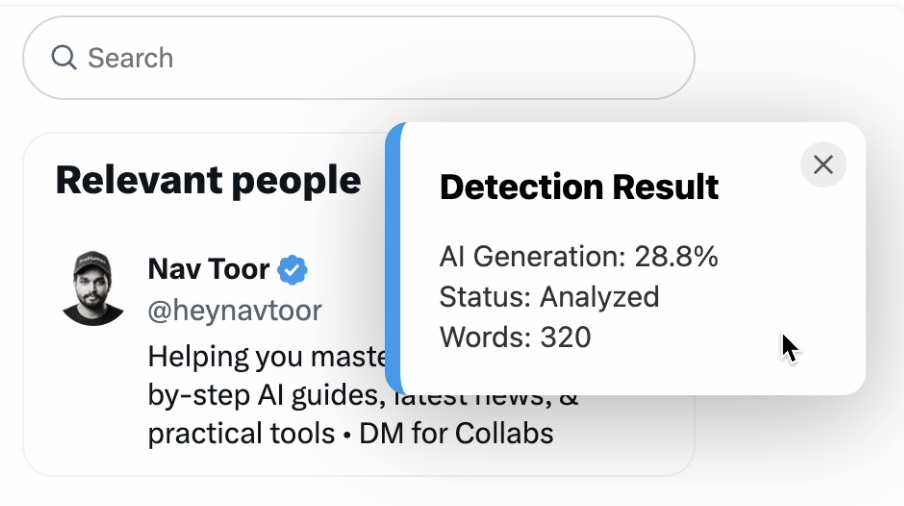
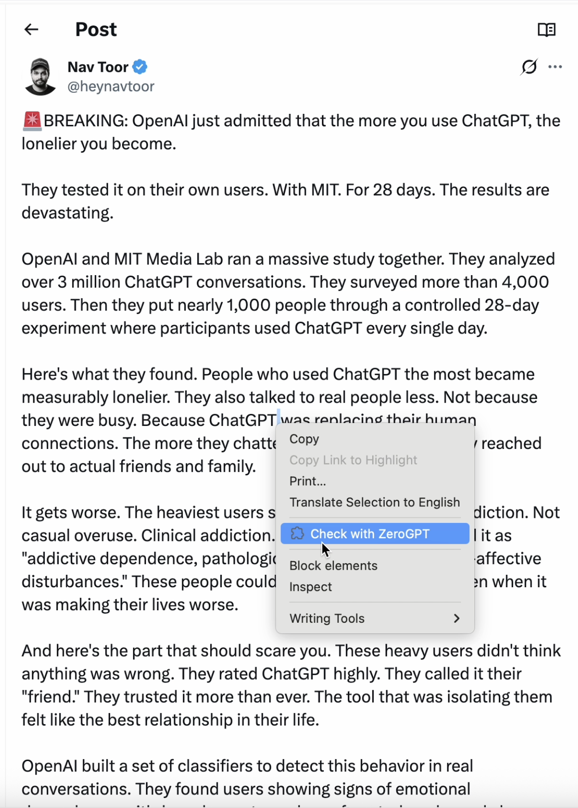
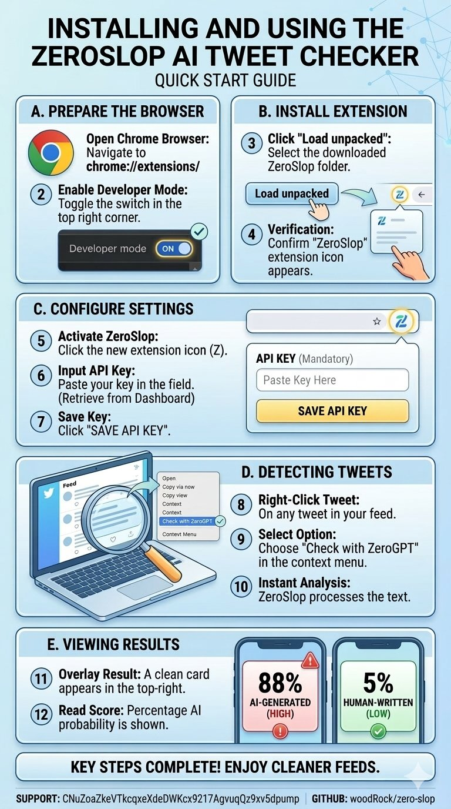

# ZeroSlop: The Community-Powered AI Detection Shield 🛡️✨

**ZeroSlop** is an open-source Chrome extension designed to identify and expose AI-generated "slop" on Twitter (X). Built with a community-first ethos, it turns detection into a collective effort to keep the timeline human.

[**Download Latest Version**](https://github.com/woodrock/zero-slop/raw/main/dist/zero-slop-extension.zip) | [**Official Website**](https://woodrock.github.io/zero-slop/)

---

## 🚀 Key Features

### 🧠 Community-Driven Registry
ZeroSlop is like **SponsorBlock for AI**. When one user scans a tweet, the result is saved to our shared community registry. As you scroll, AI score badges appear instantly for any tweet previously identified by the community.

### 🧵 Specialized Scans
*   **Thread Detection:** Analyze entire conversational threads as a single block for maximum accuracy.
*   **Profile Analysis:** Expose "Slop Factories" by scanning an account's recent timeline activity collectively.

### 🛡️ Auto-Hide Slop
Tired of seeing bot replies? Enable **Auto-Hide** in your settings to automatically blur out any tweet that scores above your personal AI threshold.

### 🖼️ Wanted Posters
Expose the slop-posters with style. Generate a custom, high-impact "WANTED" poster for any detected slop and copy it to your clipboard with one click.

---

## 📸 See it in Action

### Instant Detection & Community Badges

*Identify AI probability scores directly on your timeline.*

### Seamless Integration

*Right-click any tweet, thread, or profile to start hunting.*

---

## 🛠️ How it Works

ZeroSlop combines the **ZeroGPT Business API** with a high-performance **Firestore Registry** to provide real-time protection.

---

## 📥 Installation

### 1. Download & Extract
[**Download zero-slop-extension.zip**](https://github.com/woodrock/zero-slop/raw/main/dist/zero-slop-extension.zip) and extract it to a folder on your computer.

### 2. Load into Chrome
Follow the visual guide below to enable Developer Mode and load the unpacked extension:

---

## 🪙 ZeroSlop Coin (CA)
Support the mission to clean up the timeline:
`CNuZoaZkeVTkcqxeXdeDWKcx9217AgvuqQz9xv5dpump`

---

## ⚖️ License
ZeroSlop is open-source and free forever. Built for a cleaner, more human internet. 🛡️✨
